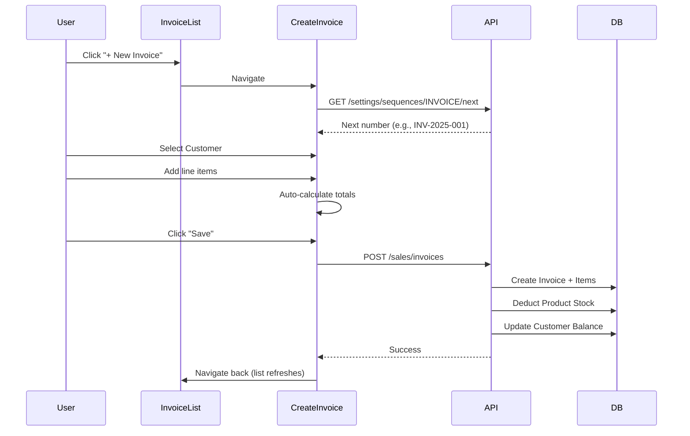

# 🔥 MSME OS - Complete System Design & Functional Coverage

**Date:** 2025-12-13  
**Last Updated:** 2025-12-13 (Launch Readiness Fixes)  
**Application:** MSME Operating System (ERP + Accounting + Compliance + Payments)  
**Version:** Production Audit v1.1

---

## 1. Application Overview

### 1.1 Architecture
```
┌─────────────────────────────────────────────────────────────┐
│                      CLIENT (React + Vite)                  │
│  ┌─────────┐ ┌─────────┐ ┌─────────┐ ┌─────────┐           │
│  │ Zustand │ │TanStack │ │ Hooks   │ │Services │           │
│  │ Stores  │ │ Query   │ │         │ │         │           │
│  └─────────┘ └─────────┘ └─────────┘ └─────────┘           │
└───────────────────────────┬─────────────────────────────────┘
                            │ REST API
┌───────────────────────────┴─────────────────────────────────┐
│                 SERVER (Node.js + Express)                  │
│  ┌─────────┐ ┌─────────┐ ┌──────────┐ ┌─────────┐          │
│  │ Routes  │→│Controllers│→│ Services │→│ Prisma  │          │
│  └─────────┘ └─────────┘ └──────────┘ └─────────┘          │
└───────────────────────────┬─────────────────────────────────┘
                            │
┌───────────────────────────┴─────────────────────────────────┐
│                   DATABASE (PostgreSQL)                     │
│                       45+ Models                            │
└─────────────────────────────────────────────────────────────┘
```

### 1.2 Tech Stack
| Layer | Technology |
|-------|-----------|
| Frontend | React 18, Vite, TypeScript, TailwindCSS |
| State | Zustand (Global), TanStack Query (Server) |
| Backend | Node.js, Express, TypeScript |
| ORM | Prisma |
| Database | PostgreSQL |
| Auth | JWT, bcrypt, Google OAuth |
| PDF | pdfkit |
| Email | Nodemailer |
| Real-time | Socket.IO |

---

## 2. Database Schema (45+ Models)

### 2.1 Core Business Models
| Model | Purpose | Key Fields |
|-------|---------|-----------|
| `Company` | Multi-tenant root | businessName, gstin, plan |
| `User` | Authentication | email, password, role, companyId |
| `Party` | Customers/Suppliers | name, type, gstin, currentBalance |
| `Product` | Inventory items | name, hsnCode, currentStock, purchasePrice, sellingPrice |

### 2.2 Sales Documents
| Model | Purpose | Unique Key |
|-------|---------|-----------|
| `Invoice` | Sales invoices | (companyId, invoiceNumber) |
| `InvoiceItem` | Line items | invoiceId FK |
| `Estimate` | Proforma/Quotes | (companyId, estimateNumber) |
| `Quotation` | Formal quotations | (companyId, quotationNumber) |
| `SalesOrder` | Sales orders | (companyId, orderNumber) |
| `DeliveryChallan` | Delivery notes | (companyId, challanNumber) |

### 2.3 Purchase Documents
| Model | Purpose |
|-------|---------|
| `PurchaseOrder` | Orders to suppliers |
| `PurchaseBill` | Supplier invoices |
| `GoodsReceivedNote` | Inward goods tracking |

### 2.4 Inventory & Warehouse
| Model | Purpose |
|-------|---------|
| `Warehouse` | Storage locations |
| `StockMovement` | Audit trail for stock changes |
| `Unit` | Units of measurement |
| `Category` | Product categories |

### 2.5 Financial
| Model | Purpose |
|-------|---------|
| `BankAccount` | Bank accounts |
| `Transaction` | Bank transactions |
| `Expense` | Business expenses |
| `PaymentReminder` | Payment follow-ups |

### 2.6 GST Compliance
| Model | Purpose |
|-------|---------|
| `GSTPayment` | Tax payments |
| `EInvoice` | E-Invoice records |
| `EWaybill` | E-Way bill records |

### 2.7 HR & Payroll
| Model | Purpose |
|-------|---------|
| `Employee` | Employee master |
| `Attendance` | Daily attendance |
| `Leave` | Leave requests |
| `SalaryStructure` | Salary components |
| `PayrollRun` | Monthly payroll |

### 2.8 CRM
| Model | Purpose |
|-------|---------|
| `Lead` | Sales leads |
| `Activity` | CRM activities |

### 2.9 Accounting
| Model | Purpose |
|-------|---------|
| `Account` | Chart of accounts |
| `Journal` | Journal vouchers |
| `JournalEntry` | Debit/Credit entries |

### 2.10 POS
| Model | Purpose |
|-------|---------|
| `POSSession` | Cashier sessions |
| `POSOrder` | POS transactions |

### 2.11 Messaging
| Model | Purpose |
|-------|---------|
| `Conversation` | Chat threads |
| `Message` | Chat messages |
| `MessageAttachment` | File attachments |

### 2.12 Settings & Security
| Model | Purpose |
|-------|---------|
| `Sequence` | Document numbering |
| `Device` | Logged-in devices |
| `IPWhitelist` | Allowed IP addresses |
| `ApprovalWorkflow` | Approval rules |
| `Invite` | User invitations |
| `AuditLog` | Change tracking |

### 2.13 Enums
`Role` (ADMIN, MANAGER, ACCOUNTANT, USER), `Status`, `InvoiceStatus`, `Plan`, `InviteType`, `MessageType`, `MessageStatus`

---

## 3. Module-wise Functional Breakdown

---

### 📦 MODULE: AUTH
**Purpose:** User registration, login, session management.

#### UI Screens
| Component | Path | Purpose |
|-----------|------|---------|
| `LoginPage.tsx` | `/login` | Email/password login |
| `RegisterPage.tsx` | `/register` | Company + User registration |
| `ForgotPassword.tsx` | `/forgot-password` | Password reset |
| `OTPLogin.tsx` | `/otp-login` | OTP-based login |

#### Forms
| Form | Fields | Validation |
|------|--------|-----------|
| Register | name, email, password, phone, businessName, gstin | Required: name, email, password, businessName |
| Login | email, password | Required: both |

#### Buttons & Actions
| Button | Location | API Call | Flow |
|--------|----------|----------|------|
| Sign Up | RegisterPage | `POST /auth/register` | Creates Company + User → Token → Dashboard |
| Login | LoginPage | `POST /auth/login` | Validates → Token → Dashboard |
| Google Login | LoginPage | `POST /auth/google` | OAuth → Token |
| Forgot Password | LoginPage | `POST /auth/forgot-password` | ⚠️ TODO (stub) |

#### APIs
| Endpoint | Method | Purpose | Status |
|----------|--------|---------|--------|
| `/api/v1/auth/register` | POST | Register user + company | ✅ Complete |
| `/api/v1/auth/login` | POST | Login | ✅ Complete |
| `/api/v1/auth/logout` | POST | Logout | ✅ Complete |
| `/api/v1/auth/me` | GET | Current user | ✅ Complete |
| `/api/v1/auth/update-profile` | PUT | Update profile | ✅ Complete |
| `/api/v1/auth/google` | POST | Google OAuth | ✅ Complete |
| `/api/v1/auth/forgot-password` | POST | Request reset | ✅ Complete |
| `/api/v1/auth/reset-password` | POST | Reset password | ✅ Complete |
| `/api/v1/auth/verify-otp` | POST | OTP verification | ✅ Complete |
| `/api/v1/auth/resend-otp` | POST | Resend OTP | ✅ Complete |

---

### 📦 MODULE: DASHBOARD
**Purpose:** Overview of business KPIs and quick actions.

#### UI Screens
| Component | Purpose |
|-----------|---------|
| `Dashboard.tsx` | Main dashboard layout |
| `KPICards.tsx` | Sales, Purchase, Expense, Receivable summaries |
| `SalesChart.tsx` | Revenue chart |
| `RecentTransactions.tsx` | Latest invoices/transactions |
| `QuickActions.tsx` | Shortcuts to create documents |

#### APIs
| Endpoint | Method | Purpose |
|----------|--------|---------|
| `/api/v1/dashboard/kpis` | GET | Summary KPIs |
| `/api/v1/dashboard/sales-chart` | GET | Chart data |
| `/api/v1/dashboard/recent-transactions` | GET | Transaction list |

---

### 📦 MODULE: PARTIES (Customers/Suppliers)
**Purpose:** Manage customers and suppliers.

#### UI Screens
| Component | Purpose |
|-----------|---------|
| `CustomerList.tsx` | List customers with search/filter |
| `SupplierList.tsx` | List suppliers |
| `AddEditCustomer.tsx` | Add/Edit customer form |
| `AddEditSupplier.tsx` | Add/Edit supplier form |
| `PartyLedger.tsx` | Transaction history for a party |

#### Forms
| Form | Fields |
|------|--------|
| Add Customer | name, gstin, pan, email, phone, billingAddress, shippingAddress, openingBalance |
| Add Supplier | Same as customer + msmeType, udyamNumber |

#### Buttons & Actions
| Button | API | Side Effect |
|--------|-----|-------------|
| Add Customer | `POST /parties` | Creates party, invalidates cache |
| Edit | `PUT /parties/:id` | Updates party |
| Delete | `DELETE /parties/:id` | Soft delete |
| View Ledger | `GET /reports/party-statement/:id` | Opens ledger modal |

#### APIs
| Endpoint | Method | Status |
|----------|--------|--------|
| `/api/v1/parties` | GET/POST | ✅ Complete |
| `/api/v1/parties/:id` | GET/PUT/DELETE | ✅ Complete |
| `/api/v1/parties/:id/ledger` | GET | ✅ Complete |

---

### 📦 MODULE: INVENTORY
**Purpose:** Product management, stock tracking, warehouses.

#### UI Screens
| Component | Purpose |
|-----------|---------|
| `ProductList.tsx` | Product list with search/filter |
| `AddEditProduct.tsx` | Multi-step product form |
| `LowStockAlert.tsx` | Low stock warnings |
| `StockAdjustment.tsx` | Manual stock corrections |
| `StockTransfer.tsx` | Inter-warehouse transfers |
| `WarehouseManagement.tsx` | Warehouse CRUD |

#### Forms (AddEditProduct)
| Step | Fields |
|------|--------|
| Basic Info | name, code, hsnCode, category, description, unit |
| Stock | currentStock, minStock, maxStock, reorderLevel, location, trackInventory |
| Pricing | purchasePrice, sellingPrice, mrp, gstRate, taxInclusive |

#### APIs
| Endpoint | Method | Purpose |
|----------|--------|---------|
| `/api/v1/inventory/products` | GET/POST | Product CRUD |
| `/api/v1/inventory/products/:id` | GET/PUT/DELETE | Single product |
| `/api/v1/inventory/adjust-stock` | POST | Stock adjustment |
| `/api/v1/inventory/transfer-stock` | POST | Warehouse transfer |
| `/api/v1/inventory/low-stock` | GET | Low stock products |
| `/api/v1/inventory/stock-history/:id` | GET | Movement history |
| `/api/v1/inventory/warehouses` | GET/POST | Warehouse CRUD |
| `/api/v1/inventory/valuation` | GET | Inventory value |

---

### 📦 MODULE: SALES
**Purpose:** Full sales lifecycle (Quote → Order → Invoice → Payment).

#### UI Screens
| Component | Purpose |
|-----------|---------|
| `InvoiceList.tsx` | Invoice list |
| `CreateInvoice.tsx` | Invoice creation form |
| `ViewInvoice.tsx` | Invoice details |
| `EstimateList.tsx` / `CreateEstimate.tsx` | Proforma invoices |
| `QuotationList.tsx` / `CreateQuotation.tsx` | Formal quotations |
| `SalesOrderList.tsx` / `CreateSalesOrder.tsx` | Sales orders |
| `DeliveryChallanList.tsx` / `CreateDeliveryChallan.tsx` | Delivery notes |

#### CreateInvoice Form
| Field | Type | Validation |
|-------|------|-----------|
| customerId | Select | Required |
| invoiceDate | Date | Required |
| dueDate | Date | Optional |
| items[] | Array | Min 1 item |
| items.productId | Select | Required |
| items.quantity | Number | > 0 |
| items.rate | Number | > 0 |
| items.taxRate | Select (GST_RATES) | Required |

#### Key Functions in CreateInvoice
| Function | Purpose |
|----------|---------|
| `fetchNextNumber()` | Gets next invoice number from sequence |
| `addItem()` | Adds a line item |
| `removeItem(id)` | Removes a line item |
| `updateItem(id, field, value)` | Updates line item |
| `selectProduct(itemId, productId)` | Auto-fills from product master |
| `handleSave()` | Submits invoice to API |

#### Buttons & Actions
| Button | API | Side Effects |
|--------|-----|--------------|
| Save Invoice | `POST /sales/invoices` | Deducts stock, updates customer balance |
| Record Payment | `POST /sales/invoices/:id/payment` | Updates balance, creates bank transaction |
| Download PDF | `GET /sales/invoices/:id/pdf` | Generates PDF via pdfkit |
| Send Email | `POST /sales/invoices/:id/send` | Emails PDF attachment |

#### APIs
| Endpoint | Method | Status |
|----------|--------|--------|
| `/api/v1/sales/invoices` | GET/POST | ✅ Complete |
| `/api/v1/sales/invoices/:id` | GET/PUT/DELETE | ✅ Complete |
| `/api/v1/sales/invoices/:id/payment` | POST | ✅ Complete |
| `/api/v1/sales/invoices/:id/pdf` | GET | ✅ Complete |
| `/api/v1/sales/invoices/:id/send` | POST | ✅ Complete |
| `/api/v1/sales/estimates` | GET/POST | ✅ Complete |
| `/api/v1/sales/orders` | GET/POST | ✅ Complete |
| `/api/v1/sales/challans` | GET/POST | ✅ Complete |

---

### 📦 MODULE: PURCHASE
**Purpose:** Purchase lifecycle (PO → GRN → Bill → Payment).

#### UI Screens
| Component | Purpose |
|-----------|---------|
| `PurchaseOrderList.tsx` | PO list |
| `CreatePurchaseOrder.tsx` | PO form |
| `GoodsReceivedList.tsx` | GRN list |
| `CreateGoodsReceivedNote.tsx` | GRN form |
| `PurchaseBillList.tsx` | Bill list |
| `CreatePurchaseBill.tsx` | Bill form |

#### APIs
| Endpoint | Status |
|----------|--------|
| `/api/v1/purchase/orders` | ✅ Complete |
| `/api/v1/purchase/grn` | ✅ Complete |
| `/api/v1/purchase/bills` | ✅ Complete |

---

### 📦 MODULE: EXPENSES
**Purpose:** Track business expenses.

#### UI Screens
| Component | Purpose |
|-----------|---------|
| `ExpensesDashboard.tsx` | Expense summary |
| `ExpenseList.tsx` | Expense list |
| `AddEditExpense.tsx` | Expense form |
| `ExpenseCategories.tsx` | Category management |

#### APIs
| Endpoint | Status |
|----------|--------|
| `/api/v1/expenses` | ✅ Complete |

---

### 📦 MODULE: BANKING
**Purpose:** Bank accounts, transactions, reminders.

#### UI Screens
| Component | Purpose |
|-----------|---------|
| `BankingDashboard.tsx` | Overview |
| `BankAccounts.tsx` | Account CRUD |
| `TransactionList.tsx` | Transaction history |
| `PaymentReminders.tsx` | Upcoming/overdue payments |
| `Reconciliation.tsx` | Bank reconciliation |

#### APIs
| Endpoint | Status |
|----------|--------|
| `/api/v1/banking/accounts` | ✅ Complete |
| `/api/v1/banking/transactions` | ✅ Complete |
| `/api/v1/banking/reminders` | ✅ Complete |
| `/api/v1/banking/dashboard` | ✅ Complete |

---

### 📦 MODULE: GST COMPLIANCE
**Purpose:** Indian GST compliance (GSTR1, GSTR3B, E-Invoice, E-Waybill).

#### UI Screens
| Component | Purpose |
|-----------|---------|
| `GSTDashboard.tsx` | Compliance overview |
| `GSTR1.tsx` | GSTR-1 report |
| `GSTR3B.tsx` | GSTR-3B report |
| `EInvoiceGeneration.tsx` | E-Invoice management |
| `EWayBill.tsx` | E-Waybill generation |
| `GSTPayments.tsx` | Tax payments |
| `HSNSummary.tsx` | HSN-wise summary |
| `ITCLedger.tsx` | Input Tax Credit |

#### APIs
| Endpoint | Status |
|----------|--------|
| `/api/v1/gst/dashboard` | ✅ Complete |
| `/api/v1/gst/gstr1` | ✅ Complete |
| `/api/v1/gst/gstr3b` | ✅ Complete |
| `/api/v1/gst/e-invoices` | ✅ Complete |
| `/api/v1/gst/e-waybills` | ✅ Complete |
| `/api/v1/gst/payments` | ✅ Complete |

---

### 📦 MODULE: REPORTS
**Purpose:** Financial and business reports.

#### UI Screens
| Component | Purpose |
|-----------|---------|
| `ReportsDashboard.tsx` | Report overview |
| `FinancialReports.tsx` | P&L, Balance Sheet |
| `AgingReport.tsx` | Receivables/Payables aging |
| `SalesReports.tsx` | Sales analytics |
| `PurchaseReports.tsx` | Purchase analytics |
| `InventoryReports.tsx` | Stock reports |
| `PartyStatement.tsx` | Party ledger |

#### APIs
| Endpoint | Status |
|----------|--------|
| `/api/v1/reports/dashboard` | ✅ Complete |
| `/api/v1/reports/profit-loss` | ✅ Complete |
| `/api/v1/reports/balance-sheet` | ✅ Complete |
| `/api/v1/reports/aging-receivables` | ✅ Complete |
| `/api/v1/reports/aging-payables` | ✅ Complete |
| `/api/v1/reports/party-statement/:id` | ✅ Complete |
| `/api/v1/reports/export/:type` | ❌ **MISSING** |

---

### 📦 MODULE: HR & PAYROLL
**Purpose:** Employee management, attendance, payroll.

#### UI Screens
| Component | Purpose |
|-----------|---------|
| `HRDashboard.tsx` | HR overview |
| `EmployeeList.tsx` | Employee list |
| `AddEditEmployee.tsx` | Employee form |
| `AttendanceManagement.tsx` | Attendance marking |
| `LeaveManagement.tsx` | Leave requests |
| `PayrollProcessing.tsx` | Monthly payroll |
| `PayslipGeneration.tsx` | Payslip PDF |

#### APIs
| Endpoint | Status |
|----------|--------|
| `/api/v1/hr/employees` | ✅ Complete |
| `/api/v1/hr/attendance` | ✅ Complete |
| `/api/v1/hr/leaves` | ✅ Complete |

---

### 📦 MODULE: CRM
**Purpose:** Lead and activity management.

#### UI Screens
| Component | Purpose | Status |
|-----------|---------|--------|
| `CRMDashboard.tsx` | Overview | ✅ |
| `LeadManagement.tsx` | Lead list | ⚠️ Minimal |
| `ActivityTracking.tsx` | Activities | ⚠️ Stub |
| `OpportunityManagement.tsx` | Opportunities | ⚠️ Stub |
| `SalesPipeline.tsx` | Pipeline view | ⚠️ Stub |

#### APIs
| Endpoint | Status |
|----------|--------|
| `/api/v1/crm/leads` | ✅ Complete |
| `/api/v1/crm/activities` | ✅ Complete |

---

### 📦 MODULE: POS
**Purpose:** Point of Sale terminal.

#### UI Screens
| Component | Purpose | Status |
|-----------|---------|--------|
| `POSTerminal.tsx` | Billing screen | ⚠️ **Uses dummy product data** |
| `POSSessionManager.tsx` | Session open/close | ✅ |

#### APIs
| Endpoint | Status |
|----------|--------|
| `/api/v1/pos/sessions/open` | ✅ Complete |
| `/api/v1/pos/sessions/close` | ✅ Complete |
| `/api/v1/pos/orders` | ✅ Complete |

---

### 📦 MODULE: MESSAGING
**Purpose:** Internal messaging between users and parties.

#### UI Screens
| Component | Purpose | Status |
|-----------|---------|--------|
| `MessagesDashboard.tsx` | Chat overview | ✅ |
| `ChatList.tsx` | Conversation list | ✅ |
| `ChatView.tsx` | Message thread | ✅ |
| `Contacts.tsx` | Contact list | ⚠️ **Uses mock data** |
| `GroupChat.tsx` | Group messaging | ✅ |

#### APIs
| Endpoint | Status |
|----------|--------|
| `/api/v1/messages/conversations` | ✅ Complete |
| `/api/v1/messages/:conversationId` | ✅ Complete |

---

### 📦 MODULE: SETTINGS
**Purpose:** Application configuration.

#### UI Screens
| Component | Purpose |
|-----------|---------|
| `BusinessProfile.tsx` | Company settings |
| `MyProfile.tsx` | User profile |
| `UserManagement.tsx` | Team users + invites |
| `DocumentNumberSettings.tsx` | Sequence configuration |
| `DeviceManagement.tsx` | Active devices |
| `IPWhitelisting.tsx` | IP access control |
| `ApprovalWorkflow.tsx` | Approval rules |
| `RoleBasedAccess.tsx` | RBAC config |
| `SecurityAudit.tsx` | Audit logs |

#### APIs
| Endpoint | Status |
|----------|--------|
| `/api/v1/settings/sequences` | ✅ Complete |
| `/api/v1/settings/devices` | ✅ Complete |
| `/api/v1/settings/ip-whitelist` | ✅ Complete |
| `/api/v1/settings/workflows` | ✅ Complete |

---

### 📦 MODULE: ANALYTICS
**Purpose:** Business intelligence charts.

#### UI Screens
| Component | Status |
|-----------|--------|
| `ProfitLossAnalysis.tsx` | ✅ |
| `CashFlowForecast.tsx` | ✅ |
| `SalesFunnel.tsx` | ✅ |
| `GSTAnalytics.tsx` | ⚠️ **Uses mock chart data** |

---

## 4. User Workflows

### 4.1 Create Invoice Flow


### 4.2 Record Payment Flow
```
Invoice (SENT) → Record Payment → Update amountPaid, balanceAmount
                                 → If full: status = PAID
                                 → If partial: status = PARTIAL
                                 → Create BankTransaction (if bankAccountId)
                                 → Decrement Party currentBalance
```

### 4.3 PDF Download Flow
```
User clicks "Download PDF"
→ GET /sales/invoices/:id/pdf
→ invoiceActionsController.downloadInvoicePDF()
→ Fetch invoice + customer + company from DB
→ pdfService.generatePDFBuffer(data)
→ pdfkit generates PDF
→ Stream as binary with Content-Type: application/pdf
```

---

## 5. RBAC Matrix

| Role | Dashboard | Sales | Purchase | Inventory | Reports | Settings | HR |
|------|-----------|-------|----------|-----------|---------|----------|-----|
| ADMIN | ✅ Full | ✅ Full | ✅ Full | ✅ Full | ✅ Full | ✅ Full | ✅ Full |
| MANAGER | ✅ Full | ✅ Full | ✅ Full | ✅ Full | ✅ Full | ❌ | ✅ View |
| ACCOUNTANT | ✅ View | ✅ Full | ✅ Full | ✅ View | ✅ Full | ❌ | ❌ |
| USER | ✅ View | ✅ Create/View | ✅ Create/View | ✅ View | ✅ View | ❌ | ❌ |

**Implementation:** `User.role` enum + `User.moduleAccess` JSON for granular permissions.

---

## 6. State Management

### 6.1 Global Stores (Zustand)
| Store | Purpose |
|-------|---------|
| `authStore.ts` | User, token, company, login/logout |
| `uiStore.ts` | Sidebar state, theme, modals |
| `notificationStore.ts` | Toast notifications |

### 6.2 Server State (TanStack Query)
| Hook | Purpose |
|------|---------|
| `useSales.ts` | Invoice, estimate, order queries/mutations |
| `usePurchase.ts` | PO, GRN, Bill queries |
| `useParties.ts` | Customer/Supplier queries |
| `useInventory.ts` | Product, warehouse queries |

---

## 7. Gap Analysis

### ❌ Missing Features
| Feature | Location | Impact |
|---------|----------|--------|
| Export to CSV/Excel | Backend `/reports/export/:type` | Users cannot export reports |
| Password Reset Token | `authController.forgotPassword` | Cannot reset password |
| OTP Verification | `authController.verifyOTP` | OTP login non-functional |

### ⚠️ Using Mock Data
| Component | Issue |
|-----------|-------|
| `POSTerminal.tsx` | Uses dummy products in cart |
| `Contacts.tsx` | Uses mock contact list |
| `GSTAnalytics.tsx` | Hardcoded chart data |
| `ActivityTracking.tsx` | Stub component |
| `OpportunityManagement.tsx` | Stub component |
| `SalesPipeline.tsx` | Stub component |

### ⚠️ Partial Implementations
| Module | Issue |
|--------|-------|
| CRM | Dashboard works, but lead management is minimal |
| POS | Session management works, terminal uses mock products |
| Analytics | Some charts use mock data |

---

## 8. Improvement Roadmap

### Priority 1: Critical Fixes
1. **Implement Export API** - Add CSV/Excel export for reports
2. **Complete Password Reset** - Generate token, send email, verify
3. **Fix POS Terminal** - Connect to real product service

### Priority 2: Replace Mock Data
1. Connect `Contacts.tsx` to real Party data
2. Connect `GSTAnalytics.tsx` to real GST data
3. Build out CRM lead management

### Priority 3: Enhancements
1. Add approval workflow enforcement
2. Add multi-currency support
3. Implement offline sync (partially implemented)

---

## 9. File Reference

### Backend Controllers (27 files)
```
server/src/controllers/
├── authController.ts
├── partiesController.ts
├── productsController.ts
├── dashboardController.ts
├── expensesController.ts
├── bankingController.ts
├── gstController.ts
├── hrController.ts
├── crmController.ts
├── posController.ts
├── settingsController.ts
├── masterdataController.ts
├── inviteController.ts
├── syncController.ts
├── sales/
│   ├── invoiceController.ts
│   └── invoiceActionsController.ts
├── purchase/
│   ├── purchaseOrderController.ts
│   ├── grnController.ts
│   └── purchaseBillController.ts
├── inventory/
│   ├── stockController.ts
│   └── warehouseController.ts
├── reports/
│   ├── financialReportsController.ts
│   ├── agingReportsController.ts
│   └── transactionReportsController.ts
├── gst/
│   ├── eInvoiceController.ts
│   ├── eWaybillController.ts
│   └── gstPaymentsController.ts
└── settings/
    ├── devicesController.ts
    ├── ipWhitelistController.ts
    └── workflowsController.ts
```

### Frontend Components (100+ files)
```
client/src/components/
├── sales/ (16 files)
├── purchase/ (12 files)
├── parties/ (6 files)
├── inventory/ (7 files)
├── expenses/ (7 files)
├── banking/ (6 files)
├── gst/ (10 files)
├── reports/ (9 files)
├── hr/ (8 files)
├── crm/ (6 files)
├── pos/ (3 files)
├── messages/ (6 files)
├── settings/ (12 files)
├── analytics/ (5 files)
└── ui/ (55 shadcn components)
```
